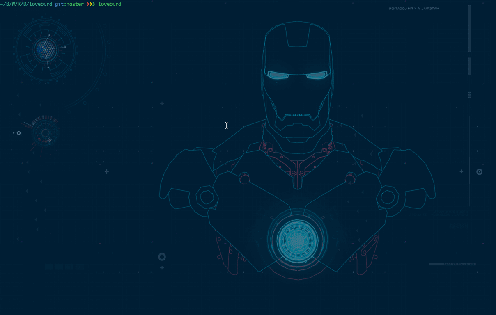

>“When the choice was: Do I want my love life determined by a psychologist or a mathematician, I pick mathematician every day of the week.” – Sam Yagan

Falling in love is easy but keeping it alive is hard or sometimes it is better to just let it go. We (Not me ;) geeks are known for failing at it miserably. But no more, we code for every problem in our life then why not this. So geeks, I present you `lovebird`. One stop solution for your love issues from breakup to compliments, lovebird have your back ;) So go ahead fall in love.

## Requirements

- Node.js

## Installation

```sh
npm install -g lovebird
```


## Running lovebird

```sh
$ lovebird
# *********************************************
# *                                           *
# *               LOVEBIRD                    *
# *                                           *
# *********************************************

lovebird$ help

#  Commands:
#
#    help [command...]  Provides help for a given command.
#    exit [options]     Exits instance of Vorpal.
#    excuse             Best excuses to get out of relationship
#    reaction           Reaction for dummies who got dumped.
#    compliment         Say something nice and save your ass.
#    gift               Give something nice and save your ass.
#    propose            Stop being shy and hit it hard.
#    survive            Get out of your shell and fight it.
```

#### `excuse` : best excuses to get out of relationship

```sh
lovebird$ excuse

# 💔💔  I Just Need A Little Space.
# 💔💔  I am breaking up because my internet is down.
```

#### `reaction` : reaction for dummies who just got dumped

```sh
lovebird$ reaction

# 🙌🙌  I can’t believe this.
```

#### `survive` : get out of your shell and fight it.

```sh
lovebird$ survive

# 🙌🙌  Eat healthfully and regularly.
```

#### `compliment` : say something nice and save your ass

```sh
lovebird$ compliment

# 😻😻  You make me feel like it's summer.
```
#### `propose` : stop being shy and hit it hard.

```sh
lovebird$ propose

# 😻😻 I wanna say I love you, I wanna hold you tight
# I want your arms around me & I want your lips on mine
# I wanna say I love you, but, babe I 'm terrified
# My hands are shaking, my heart is racing
# Cause it 's something I can't hide, it 's something I can't deny
# So here I go.....
# Baby, I lo - o - o - ve you......
```

#### `gifts` : give something nice and save your ass

```sh
lovebird$ gift

# 😻😻   Star Wars Lightsaber Candlestick.
```

## Commands

- [x] `excuse` (Best excuses to get out of relationship)
- [x] `reaction` (Reaction for dummies who got dumped)
- [x] `compliments` (Say something nice and save your ass)
- [x] `gifts`  (Give something nice and save your ass.)
- [x] `propose` (Stop being shy and hit it hard.)
- [x] `survive` (Get out of your shell and fight it.)
- [ ] `count` (Count the love.)


## Author
[Ravi Suhag](http://www.ravisuhag.com)